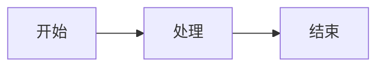

# 测试文档

这是一个测试 Markdown 文档，用于验证 Markdown Go 插件的基础功能。

## 标题测试

### 三级标题

这是一个段落。

## LaTex/Mermai测试

$$
E = mc^{2} \quad \Rightarrow \quad \int_{0}^{\infty} e^{-x^{2}} \, dx = \frac{\sqrt{\pi}}{2}
$$



## 图片测试


## 列表测试

### 无序列表

- 苹果
- 香蕉
- 橙子

### 有序列表

1. 第一步：打开文档
2. 第二步：点击 + 按钮
3. 第三步：选择列表类型

### 列表交互（手动验证）

1. 在最后一项行尾按 Enter，应自动追加同类型新项
2. 在空的列表项按 Enter，应退出列表（转为正文段落）
3. 在列表项行首按 Backspace，应转回正文段落且保留内容
4. 删除中间一项后，下方编号应自动从 1 重新计数

## 代码块测试

```javascript
function hello(name) {
  console.log(`Hello, ${name}!`);
  return name.length;
}
```

```python
def fibonacci(n):
    if n < 2:
        return n
    return fibonacci(n - 1) + fibonacci(n - 2)
```

```
// 无语言标识的纯代码块
plain code block
  with indentation preserved
```

代码块交互（手动验证）：

1. 点击 + 按钮选择"代码块 { }"，弹出输入框；Shift+Enter 换行，Enter 确认
2. 行首按钮在代码块上显示为 `{ }`
3. 双击代码块预览可进入源码编辑，再按 Enter 退出回预览
4. 保存后重新打开，语言标识应原样保留

## 结束

测试完成。
